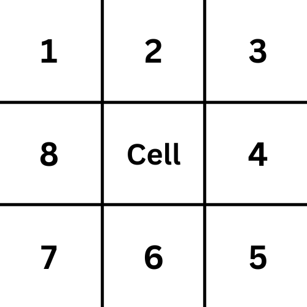

# Conway's Game of Life
A rust implementation of Conway's game of life using macroquad
## Build Instructions
Clone the Repo and then run:
```
cargo build
cargo run
```
## Usage Instructions
Click or drag with your mouse to turn on or "populate" cell's and press space to start or pause the simulation. Right clicking on a cell turns it off.

## Game of life algorithm
The game of life takes place in an infinite two dimensional grid of cells. However in this implementation the grid is finitely large. A cell can be alive or dead. every cell relates to 8 of it's direct neighbors
<p align="center">
  
</p>
Rules:

* if the cell is live and has < 2 live neighbors it dies
- if the cell is live and has exactly 2 or 3 live neighbors it lives
- if the cell is live and has more than 3 neighbors it dies
- if the cell is dead and has exactly 3 neighbors it becomes live
